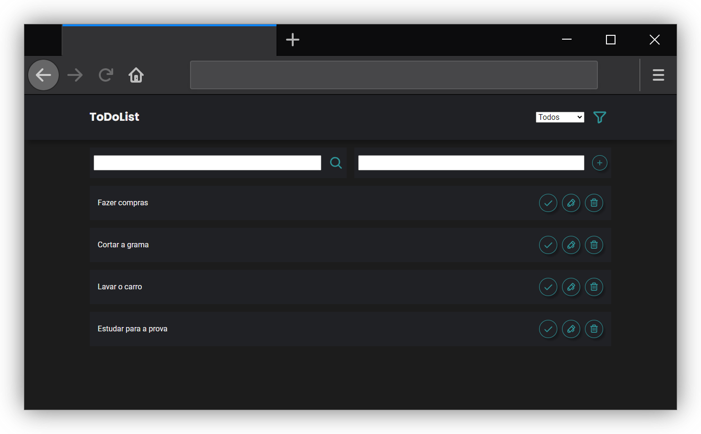
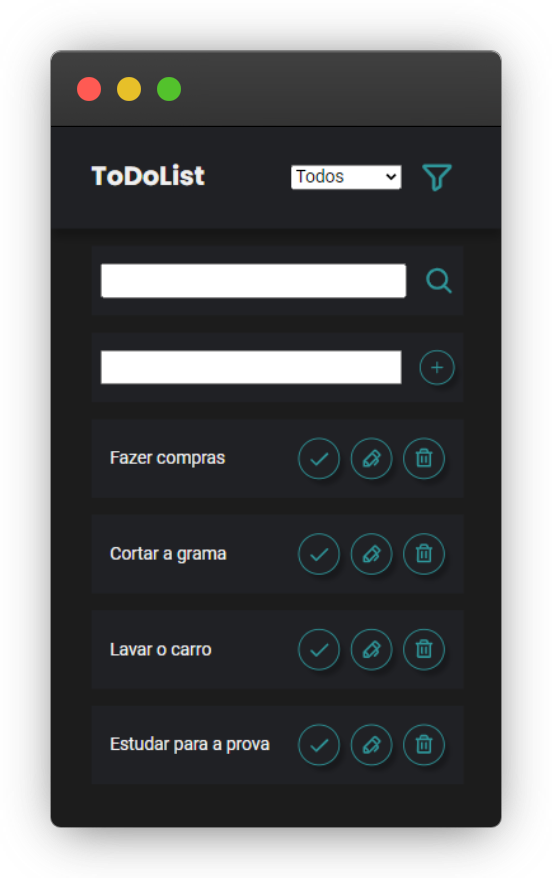

## <a href="#"></a> Projeto individual do módulo 5 - CDA 

**Contexto:** *Desenvolver um aplicativo de lista de tarefas usando JavaScript e React. Permitindo que o usuário gerencie suas tarefas de forma eficiente: adicionando, editando e marcando como concluídas. Deve ter recursos de filtragem e busca para facilitar a localização de tarefas específicas.*

## 🛠️ Como instalar e rodar o App

 Tenha o Node.js instalado, caso ainda não tenha, faça o download no link abaixo: 

- [Download Node.js](https://nodejs.org/)

###  Windows

✔️ Testado no CMD e Powershell

Clone o repositório no terminal com o seguinte comando:

```
git clone https://github.com/julianebueno/projetoIndividual5-CDA
```

Entre na pasta onde estão os aquivos:

```
cd .\projetoIndividual5-CDA\
```
Instale os pacotes necessários para a ferramenta funcionar:
```
npm install
```
Rode o App:
```
npm run dev
```
Acesse a aplicação no navegador com o seguinte link:
```
http://localhost:5173/
```

- Ps.: Para encerrar a aplicação digite CTRL + C no terminal

## 🚀 Resultados

<div align="center">
  
  
</div>


## 📄 Referências / Inspirações

[React.js Example ToDoList](https://reactjsexample.com/tag/todo/)

[Matheus Battisti](https://www.youtube.com/@MatheusBattisti)

<!-- [Ibas Logic](https://ibaslogic.com/how-to-edit-todos-items-in-react/) -->